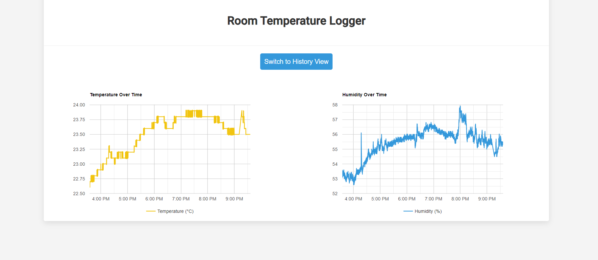

# Room Temperature Logger

Room Temperature Logger is a Raspberry Pi based web application that provides real-time tracking and history logging of room temperature and humidity. The application utilizes a DHT22 sensor for data collection and presents the data through a user-friendly web interface, which includes live temperature and humidity readings and charts for historical data.

## Features

- Displays live temperature and humidity data updates on the web interface
- Presents historical temperature and humidity data as line charts
- Stores data in a local SQLite database
- Charts shows all historical data with data points every 5 seconds

## Screenshots

 

## Tech Stack

- `Node.js` - evented I/O for the backend
- `Express` - fast node.js network app framework
- `SQLite` - a light-weight relational database management system
- `Google Charts` - interactive SVG charts for the browser
- `Raspberry Pi` - one small single-board computer
- `DHT22 sensor` - basic, low-cost digital temperature and humidity sensor
